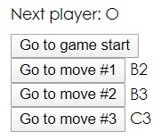
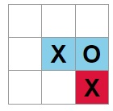
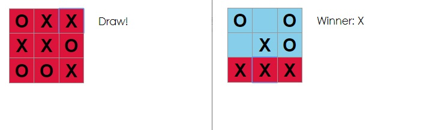
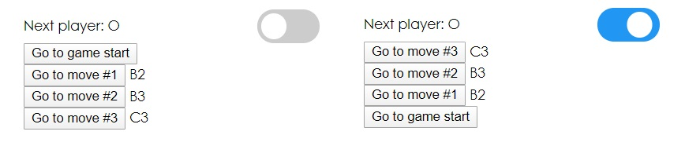

# React-Redux Tic-Tac-Toe Mini Project

React 자습서 (https://ko.reactjs.org/tutorial/tutorial.html) 에 내용 中

자습서 최종 결과 : https://codepen.io/gaearon/pen/gWWZgR?editors=0010

시간이 더 있거나 새로운 React 기술을 연습하고 싶은 경우 

다음과 같이 난이도를 높일 수 있는 틱택토 게임 개선 아이디어를 구현해보세요.

- 이동 기록 목록에서 특정 형식(행, 열)으로 각 이동의 위치를 표시해주세요.
- 이동 목록에서 현재 선택된 아이템을 굵게 표시해주세요.
- 사각형들을 만들 때 하드코딩 대신에 두 개의 반복문을 사용하도록 Board를 다시 작성해주세요.
- 오름차순이나 내림차순으로 이동을 정렬하도록 토글 버튼을 추가해주세요.
- 승자가 정해지면 승부의 원인이 된 세 개의 사각형을 강조해주세요.
- 승자가 없는 경우 무승부라는 메시지를 표시해주세요.

위 내용을 보고, 제공되있던 Tic-Tac-Toe 코드를 React-Redux + Hooks 로 바꾸어 위 기능을 추가하면서 

PR 을 연습하며, React App 깃허브 페이지 배포, React-Redux Tic-Tac-Toe 프로젝트를 시작하였습니다.

## PR 기록

https://github.com/jhlee225/tic-tac-toe-redux/pulls?q=is%3Apr+is%3Aclosed

(실수로 Revert 했거나 logo 사진 제거 등 을 제외한 PR 기록)

## `#0 Redux Tic-Tac-Toe`

React 자습서의 Class형 코드를 Hooks 와 Redux를 가미한 코드로 수정하였습니다.

## `#1 Move Winner State to Redux`

승리 판정함수를 Redux 로 이동하여 Store 에서 winner state 를 관리

## `#2 Plus Position Showed`

이동 기록 목록에서 (행,열) 로 각 이동의 위치 표시

## `#4 Focus On Selecting`

선택한 사각형 강조

## `#8 Draw Judge`

무승부 판정 및 승리 판정시 승리한 이유인 사각형 강조

## `#9 Make Toggle Button`

토글 버튼을 만들어 이동순서를 오름차순/내림차순 정렬

## `#10 Remove Hard Coding`

Board 재 작성

## 추후 업데이트 예정...

- Code Refactoring

## GitHub page 배포완료

https://jhlee225.github.io/tic-tac-toe-redux/ 에서 실행 결과를 확인 할 수 있습니다
